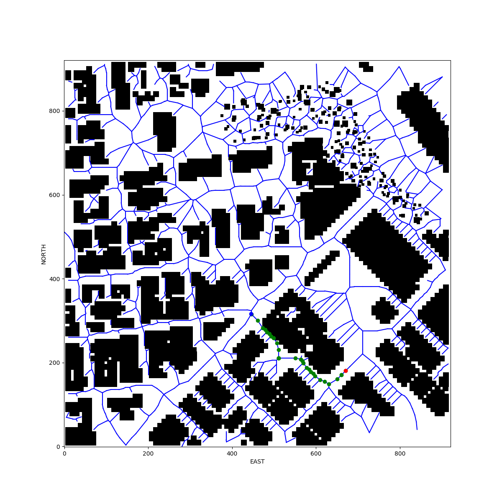
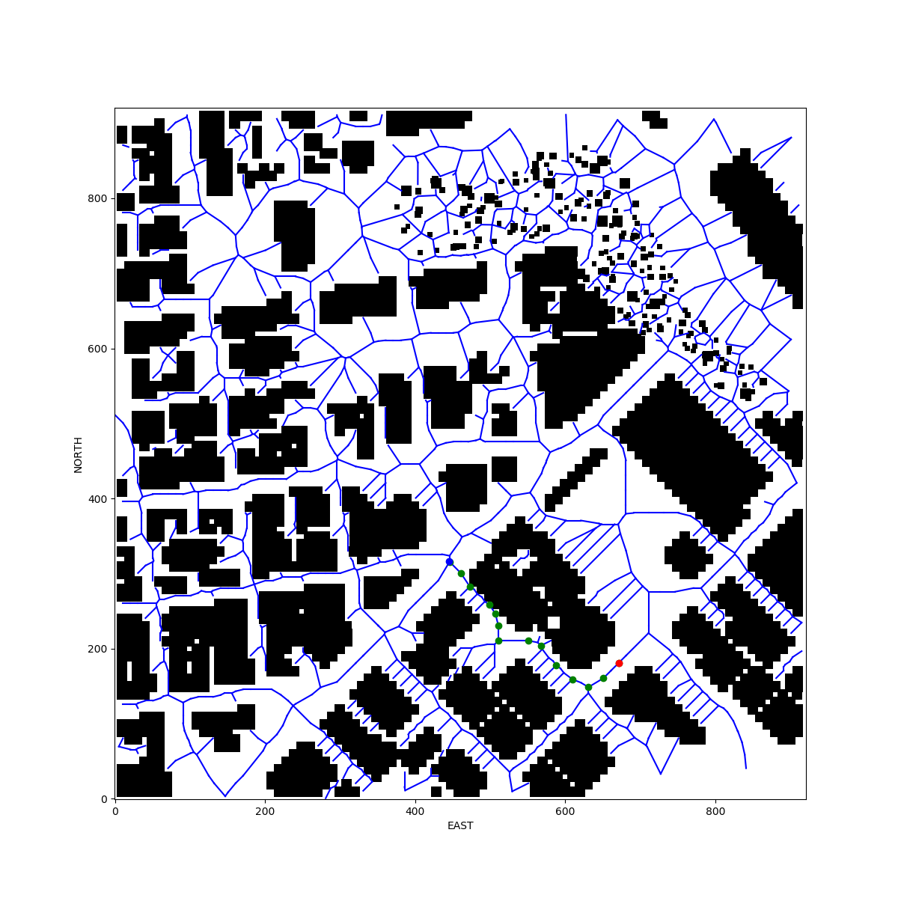
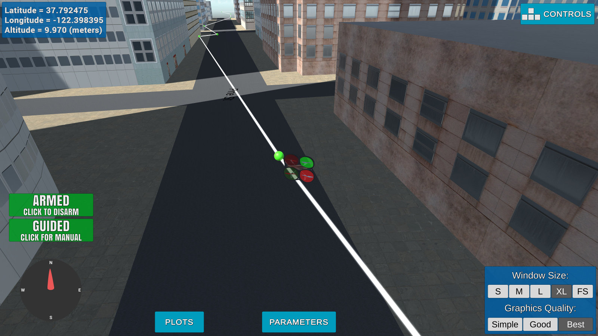

## Project: 3D Motion Planning

### Prerequisites
networkx==2.1, bresenham, scipy packages need to be installed

### Here I will consider the rubric points individually and describe how I addressed each point in my implementation.  

### Writeup / README
#### 1. Provide a Writeup / README that includes all the rubric points and how you addressed each one.  You can submit your writeup as markdown or pdf.  

You're reading it! Below I describe how I addressed each rubric point and where in my code each point is handled.

### Explain the Starter Code

#### 1. Explain the functionality of what's provided in `motion_planning.py` and `planning_utils.py`

`motion_planning.py` is a modified version of `backyard_flyer_solution.py`:
- One more PLANNING state is added between ARMING and TAKEOFF
- `plan_path` function is invoked during PLANNING state which does the actual path planning (with help of `planning_utils.py`) and populates waypoints array:
  * initialize local and globabl position, and set home location
  * read obstacles map and convert it to grid with given altitude and safety margin using `create_grid` function from `planning_utils.py`
  * define start and goal locatons on the grid
  * find a path using a-star algorythm from `planning_utils.py`
  * populate waypoints array from path
- There is also `send_waypoints` function to visualize waypoints in simulator
- after the PLANNING state, it goes to TAKEOFF and WAYPOINT states to follow the waypoints one by one till the last waypoint is reached
- when the last waypoint is reached, it goes to LANDING and then DISARMED state

### Implementing Your Path Planning Algorithm

#### 1. Set your global home position
- Read first line of colliders.csv, parse it and put into dictionary
- Use 'lon0' and 'lat0' to get longitude and latitude
- Use the self.set_home_position() method to set global home

#### 2. Set your current local position
Determine your local position relative to global home:
- Use global_to_local() with global_position and global_home

#### 3. Set grid start position from local position
- Set grid_start to local position adjusted to the north and east offsets from the obstacle grid

#### 4. Set grid goal position from geodetic coords
- Choose multiple geo coordinates on the map that can be reached
- Pick randomly on of the destinations

#### 5. Modify A* to include diagonal motion (or replace A* altogether)
- Create Voronoi graph as described in Lesson 6.15 (Graph Search Exercise)
- Set the weight of the edges to the Euclidean distance between the vertices
- Use bresenham method to check that edges don't collide with obstacles
- Perform A-star on the graph to find the path

#### 6. Cull waypoints 
- Use collinearity check to prune the path - from exercise in lesson 6.9 (Putting it Together Exercise)
- Increase the epsilon in collinearity check function to get rid of 'almost collinear' points

### Execute the flight

### Double check that you've met specifications for each of the [rubric](https://review.udacity.com/#!/rubrics/1534/view) points.
  
# Extra Challenges: Real World Planning
Maybe next time :(

